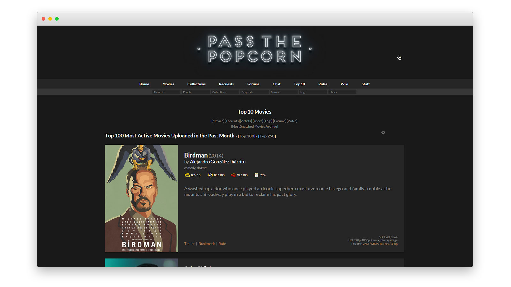
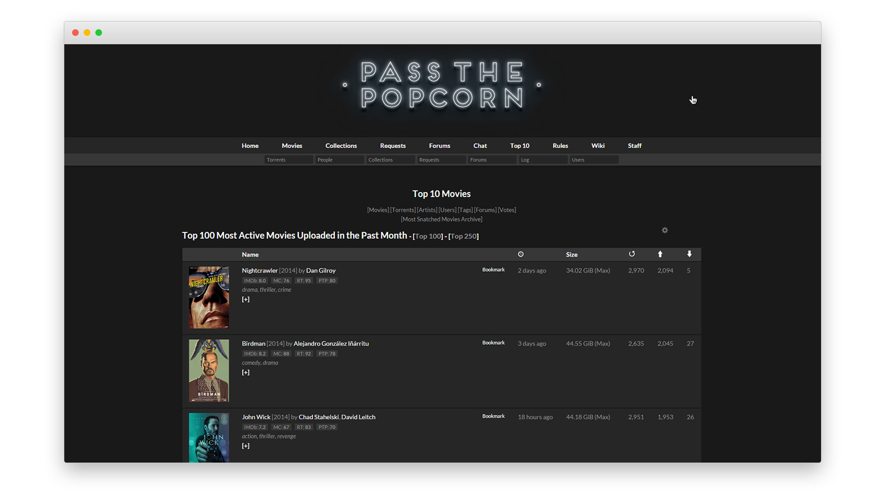

Main branch is now omnibar since I don't know how to Github. I'm also editing it with the Github code editor lol, been meaning to switch to stylish (using browser inspector to style in realtime atm) and make my commits fewer but more significant.

This style breaks PTP significantly (removes searchbars) without the poorly coded but partially functional userscript I'm developing in tandem. If I were very smart I would disable the searchbars in the userscript and not this style...but I'm only a little smart and yes lazy.

# ptp

> *Like I said, what the f💣 are we supposed to do?*
<br>

## Django <sup>`BETA`</sup>
Standalone stylesheet
```
https://jimpalompa.github.io/ptp/css/django.css
```
<sup>No previews available yet : (</sup>

## Broomhilda
Standalone stylesheet
```
Workinonit..
```
<sup>No previews available yet : (</sup>

## Marcel
Standalone stylesheet
```
https://jimpalompa.github.io/ptp/css/marcel.css
```




## Shosanna
Standalone stylesheet
```
https://jimpalompa.github.io/ptp/css/shosanna.css
```
<sup>No previews available yet : (</sup>
